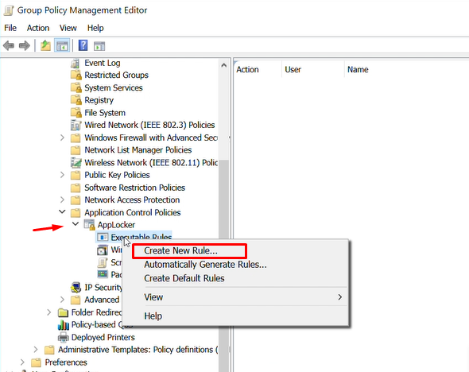
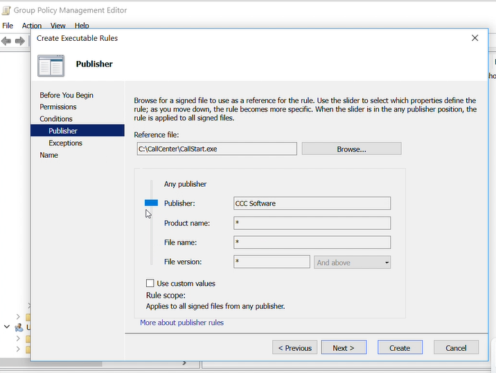

# AppLocker – Application Control

## Scenario
The organization needed to strengthen endpoint security by preventing unauthorized applications from executing on domain-joined systems. Only trusted applications located in approved directories and signed by verified publishers should be allowed to run. Additionally, a specific support application located outside standard directories needed to remain accessible to an authorized support group.

## Configuration Performed
AppLocker was configured through the Default Domain Policy using Group Policy Management. Default allow rules were created to permit executables located in the **Windows** and **Program Files** directories. Publisher-based rules were implemented to allow future updates from trusted software vendors without requiring policy changes.

A specific allow rule was also created to permit the support group to execute an application located in a custom directory (`C:\CallCenter\`). All other applications outside the defined allow rules were implicitly denied.

## Configuration Evidence

The following screenshots demonstrate the AppLocker configuration performed through Group Policy Management.

### AppLocker Rules in Group Policy

### Publisher-Based Allow Rule

### Custom Allow Rule for Support Application

## Security Purpose
This configuration enforces application whitelisting by default-deny behavior. By allowing only explicitly approved applications to execute, the organization reduces the risk of unauthorized or malicious software running on endpoints.

## Incident Types Mitigated
- Malware execution from unauthorized locations  
- Unauthorized software installation and use  
- Abuse of user-level execution privileges  
- Initial execution phase of endpoint-based attacks  

## Preparation Phase Alignment
Application whitelisting is a proactive security control implemented before an incident occurs. AppLocker strengthens endpoint security posture by reducing attack surface and enforcing centralized execution policies across the enterprise.
