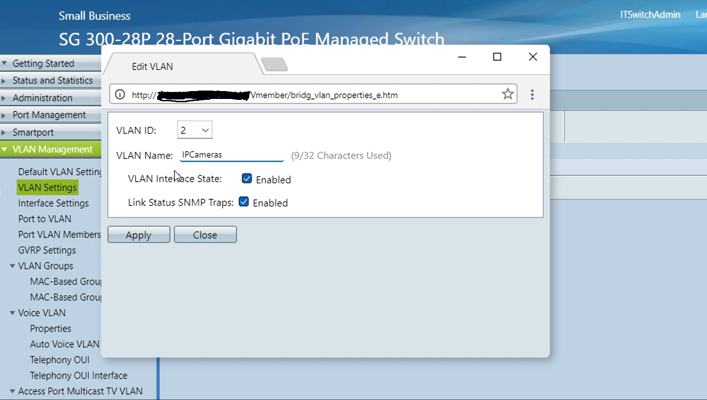
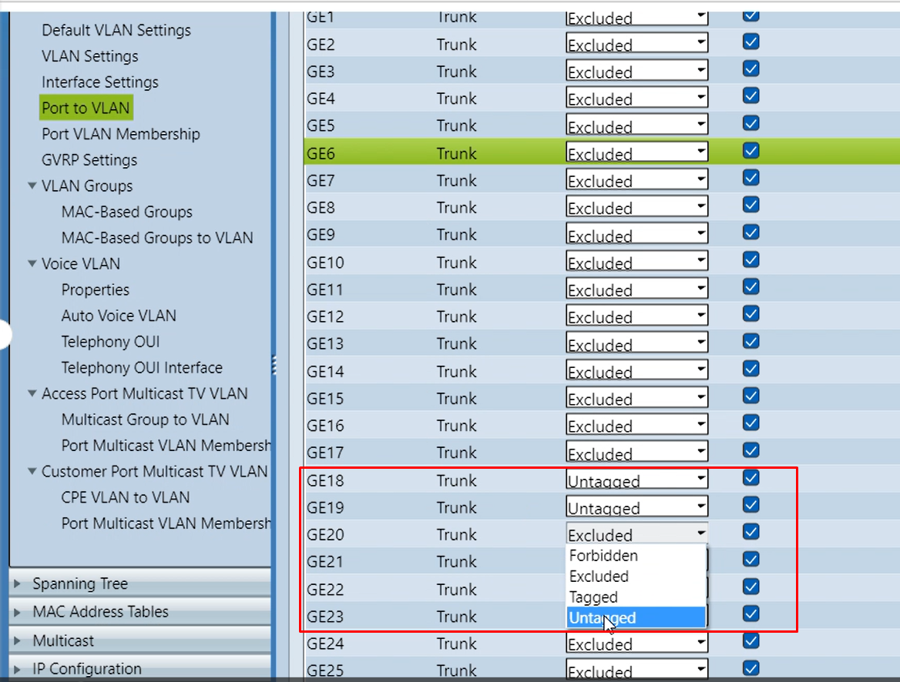
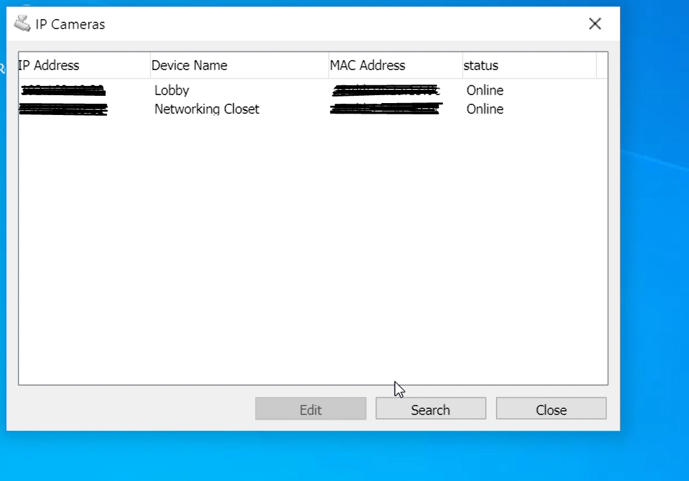

# Network Segmentation – VLANs

## Scenario
The organization required improved network security and traffic management by isolating IP camera traffic from the rest of the corporate network. Segmentation was implemented to reduce risk, limit broadcast traffic, and improve visibility into security-relevant network activity.

## Configuration Performed
VLANs were configured on a Cisco-managed switch to separate CCTV camera traffic from standard user and administrative network traffic. A dedicated VLAN was created for IP cameras, and specific switch ports were assigned as access ports within that VLAN.

Patch panel connections were mapped to the appropriate switch ports, and DHCP services were configured to support devices within the segmented VLAN.

## Configuration Evidence
The following screenshots demonstrate VLAN creation and port assignment on the switch.

### VLAN Creation on Switch
*Dedicated VLAN created for IP cameras to isolate CCTV traffic from the corporate network.*

### Port Assignment to VLAN
*Switch ports configured as untagged access ports for IP cameras.*

### IP Camera Network Connectivity
*Verification that IP cameras obtained network connectivity within the segmented VLAN.*

## Security Purpose
Network segmentation limits lateral movement by isolating devices with different risk profiles. By separating IP cameras from the primary network, the organization reduces the attack surface and improves containment capabilities in the event of a compromise.

## Incident Types Mitigated
- Lateral movement from compromised IoT devices
- Network congestion affecting critical services
- Unauthorized access between network segments
- Reduced visibility into security-relevant traffic

## Preparation Phase Alignment
VLAN segmentation is a proactive control implemented before incidents occur. It strengthens network security by enforcing logical separation, improving monitoring capabilities, and supporting faster containment during security incidents.
